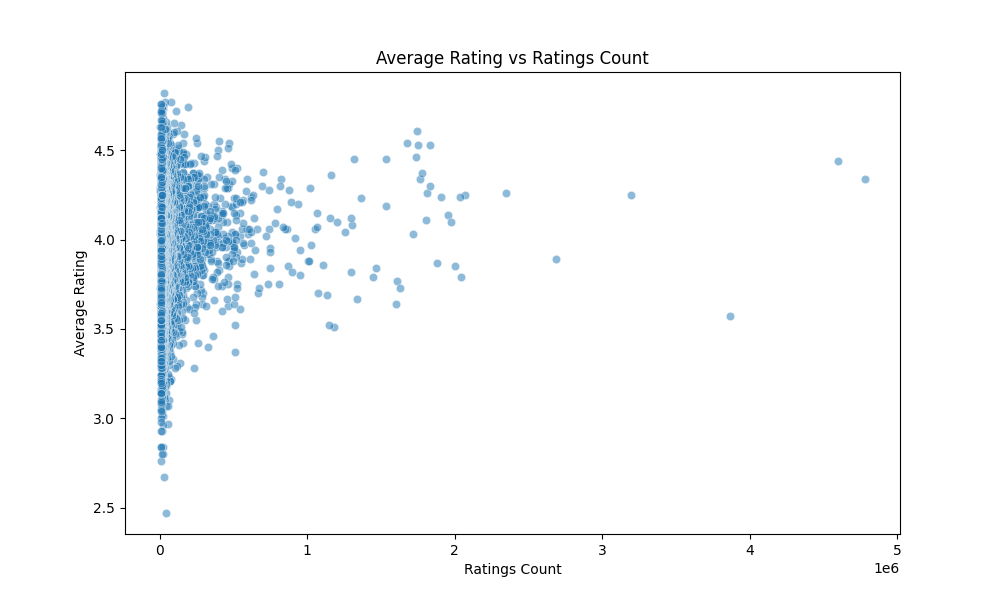
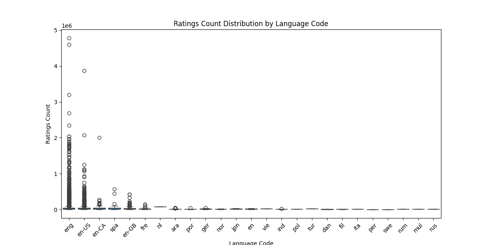
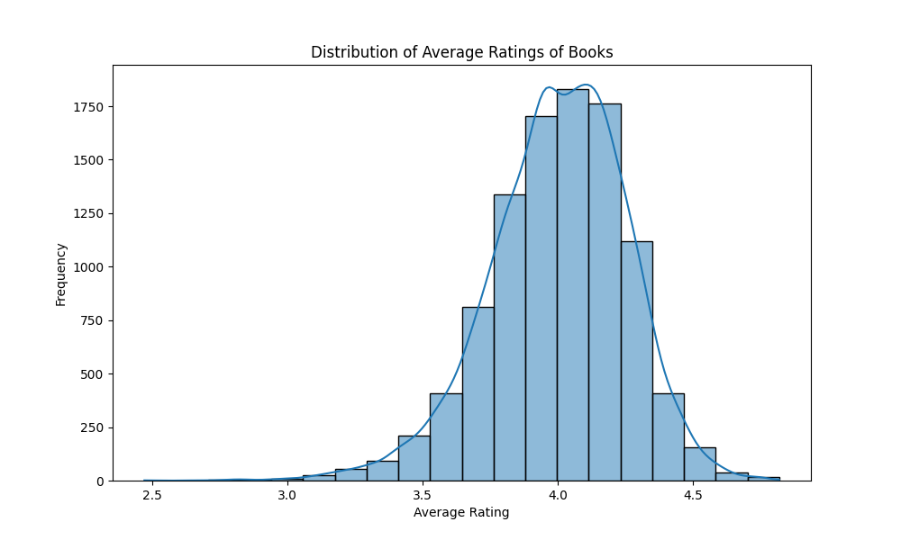

# GOODREADS

## Overview
The GOODREADS dataset comprises a rich collection of book-related data sourced from the Goodreads platform. It includes valuable information about various books, their authors, and user feedback, providing great insights for literary analysis, recommendation systems, and understanding reader preferences.

## Column Details
The dataset contains the following columns:

| #   | Column                     | Non-Null Count | Dtype      |
|-----|---------------------------|----------------|------------|
| 0   | book_id                   | 10000 non-null | int64      |
| 1   | goodreads_book_id         | 10000 non-null | int64      |
| 2   | best_book_id              | 10000 non-null | int64      |
| 3   | work_id                   | 10000 non-null | int64      |
| 4   | books_count               | 10000 non-null | int64      |
| 5   | isbn                      | 9300 non-null  | object     |
| 6   | isbn13                    | 9415 non-null  | float64    |
| 7   | authors                   | 10000 non-null | object     |
| 8   | original_publication_year | 9979 non-null  | float64    |
| 9   | original_title            | 9415 non-null  | object     |
| 10  | title                     | 10000 non-null | object     |
| 11  | language_code             | 8916 non-null  | object     |
| 12  | average_rating            | 10000 non-null | float64    |
| 13  | ratings_count             | 10000 non-null | int64      |
| 14  | work_ratings_count        | 10000 non-null | int64      |
| 15  | work_text_reviews_count   | 10000 non-null | int64      |
| 16  | ratings_1                 | 10000 non-null | int64      |
| 17  | ratings_2                 | 10000 non-null | int64      |
| 18  | ratings_3                 | 10000 non-null | int64      |
| 19  | ratings_4                 | 10000 non-null | int64      |
| 20  | ratings_5                 | 10000 non-null | int64      |
| 21  | image_url                 | 10000 non-null | object     |
| 22  | small_image_url           | 10000 non-null | object     |

This dataset is structured to give insights into the books listed, their unique identifiers, authorship, publication details, ratings, and image URLs for visual representation.

## Numerical Details
Analyzing numerical columns provides us the following insights:

|         | book_id         | goodreads_book_id | best_book_id    | work_id       | books_count     | isbn13          | original_publication_year | average_rating | ratings_count | work_ratings_count | work_text_reviews_count | ratings_1 | ratings_2 | ratings_3 | ratings_4 | ratings_5 |
|---------|-----------------|-------------------|------------------|---------------|-----------------|------------------|----------------------------|----------------|---------------|--------------------|-------------------------|-----------|-----------|-----------|-----------|-----------|
| count   | 10000.000       | 10000.000         | 10000.000        | 10000.000     | 10000.000       | 9415.000         | 9979.000                  | 10000.000      | 10000.000     | 10000.000          | 10000.000               | 10000.000 | 10000.000 | 10000.000 | 10000.000 | 10000.000 |
| mean    | 5000.500        | 5264696.513       | 5471213.580      | 8646183.425   | 75.713          | 9755044298883.463 | 1981.988                  | 4.002          | 54001.235     | 59687.322          | 2919.955                 | 1345.041  | 3110.885  | 11475.894 | 19965.697 | 23789.806 |
| std     | 2886.896        | 7575461.864       | 7827329.891      | 11751060.824  | 170.471         | 442861920665.573 | 152.577                   | 0.254          | 157369.956    | 167803.785         | 6124.378                | 6635.626  | 9717.124  | 28546.449 | 51447.358 | 79768.886 |
| min     | 1.000           | 1.000             | 1.000            | 87.000        | 1.000           | 195170342.000    | -1750.000                 | 2.470          | 2716.000      | 5510.000          | 3.000                   | 11.000    | 30.000    | 323.000    | 750.000    | 754.000    |
| 25%     | 2500.750        | 46275.750         | 47911.750        | 1008841.000   | 23.000          | 9780316192995.000 | 1990.000                  | 3.850          | 13568.750     | 15438.750         | 694.000                 | 196.000   | 656.000   | 3112.000   | 5405.750   | 5334.000   |
| 50%     | 5000.500        | 394965.500        | 425123.500       | 2719524.500   | 40.000          | 9780451528640.000 | 2004.000                  | 4.020          | 21155.500     | 23832.500         | 1402.000                | 391.000   | 1163.000  | 4894.000   | 8269.500   | 8836.000   |
| 75%     | 7500.250        | 9382225.250       | 9636112.500      | 14517748.250  | 67.000          | 9780830777175.000 | 2011.000                  | 4.180          | 41053.500     | 45915.000         | 2744.250               | 885.000   | 2353.250  | 9287.000   | 16023.500  | 17304.500  |
| max     | 10000.000       | 33288638.000      | 35534230.000     | 56399597.000  | 3455.000        | 9790007672390.000 | 2017.000                  | 4.820          | 4780653.000    | 4942365.000         | 155254.000               | 456191.000 | 436802.000 | 793319.000   | 1481305.000 | 3011543.000 |

The numerical analysis indicates a balanced distribution of books with a significant number of average ratings hovering around the 4.0 marker, indicating general reader satisfaction.

## Categorical Details
Analyzing categorical columns, we find:

- **Column 'isbn'**:
  - Unique value count: 9300
  - Missing values: 700 (7.00% of total)

- **Column 'authors'**:
  - Unique value count: 4664
  - Most frequent value (mode): Stephen King (60 occurrences)
  - Missing values: 0 (0.00% of total)

- **Column 'original_title'**:
  - Unique value count: 9274
  - Missing values: 585 (5.85% of total)

- **Column 'title'**:
  - Unique value count: 9964
  - Most frequent value (mode): Selected Poems (4 occurrences)
  - Missing values: 0 (0.00% of total)

- **Column 'language_code'**:
  - Unique value count: 25
  - Most frequent value (mode): eng (6341 occurrences)
  - Missing values: 1084 (10.84% of total)

- **Column 'image_url'**:
  - Unique value count: 6669
  - Most frequent value (mode): [https://s.gr-assets.com/assets/nophoto/book/111x148-bcc042a9c91a29c1d680899eff700a03.png](https://s.gr-assets.com/assets/nophoto/book/111x148-bcc042a9c91a29c1d680899eff700a03.png) (3332 occurrences)
  - Missing values: 0 (0.00% of total)

- **Column 'small_image_url'**:
  - Unique value count: 6669
  - Most frequent value (mode): [https://s.gr-assets.com/assets/nophoto/book/50x75-a91bf249278a81aabab721ef782c4a74.png](https://s.gr-assets.com/assets/nophoto/book/50x75-a91bf249278a81aabab721ef782c4a74.png) (3332 occurrences)
  - Missing values: 0 (0.00% of total)

These categorical analyses reveal the richness of authorship diversity within the dataset and indicate a significant presence of English content, especially concerning reader engagement.

## Visual Analysis

### Average Rating vs Ratings Count

This graph shows a scatter plot titled "Average Rating vs Ratings Count." Here’s the analysis:

#### Description of the Graph:
- **X-axis:** Represents "Ratings Count," indicating the total number of ratings a product or item has received.
- **Y-axis:** Represents "Average Rating," showing the average score (presumably on a scale from 1 to 5).
- **Data Points:** Presented as blue dots scattered throughout the graph.

#### Key Observations:
1. **Trend Observations:**
   - Higher ratings counts generally correlate with higher average ratings, particularly before around 1 million ratings.
   - Beyond approximately 1 million counts, the average rating's increase becomes less pronounced.

2. **Clusters:**
   - Data points are mostly clustered towards the lower end of the ratings count (particularly around 3.5 to 4.0).

3. **Outliers:**
   - A few items with high ratings counts have average ratings below 4.0, indicating that a high number of ratings does not always translate to a high average score.

4. **Notable Features:**
   - The density below 1 million ratings contrasts with a sparse spread for counts greater than this threshold.

#### Implications:
- Popularity does not equate to quality, reminding consumers and analysts that a high number of ratings can accompany a lower average score.

### Ratings Count Distribution by Language Code

The image presents a bar graph titled "Ratings Count Distribution by Language Code." Here's an analysis of the graph:

#### Description of the Graph:
- **X-Axis:** Represents different language codes (e.g., en, es, fr, etc.).
- **Y-Axis:** Indicates the count of ratings, with values reaching up to 5 million.

#### Key Observations:
- **Distribution:** English ratings (language code "en") significantly outnumber others, indicating a dominant trend in engagement.
- **Other Languages:** The next highest ratings belong to "es" (Spanish) and "fr" (French), but their counts are substantially lesser.
- **Sparse Distribution:** Languages aside from English reveal minimal engagement in comparison.

#### Implications:
- The dataset underscores that while content in English predominates, opportunities exist to enhance reach in other languages.

### Average Rating Distribution

This image illustrates the distribution of average ratings of books, presented as a histogram with a fitted density curve.

#### Description of the Graph:
- **Type:** Histogram with a density curve overlay.
- **X-axis:** Represents the "Average Rating" of books between approximately 2.5 to 4.5.
- **Y-axis:** Indicates the frequency of ratings ranging from 2 to 10.

#### Key Patterns/Insights:
- **Shape:** The histogram appears roughly normal, peaking around an average rating of 4.0.
- **Frequency:** The greatest frequency occurs between ratings 3.5 and 4.2, indicating strong book acceptance.
- **Skewness:** The left skew suggests that while lower ratings exist, they are still fewer compared to higher ratings.
- **Outliers:** Relatively few outliers exist beyond the peak rating, with values clustered around 3.5 to 4.2.

#### Implications:
- The dataset suggests that books generally receive positive ratings, with strong demand indicators favoring ratings above 4.0. Improvements could be targeted towards books rated below 3.0.

## How the Analysis Was Carried Out
To perform the analysis on the GOODREADS dataset, the following steps were undertaken:
1. **Data Loading:** Importing the dataset from a CSV format to a DataFrame for easier manipulation.
2. **Data Cleaning:** Checking for missing values and determining the structure of data to ensure accurate analysis.
3. **Numerical Analysis:** Calculating descriptive statistics to understand distributions, means, and outliers within numerical recordings.
4. **Categorical Analysis:** Analyzing unique counts and frequencies within categorical columns to understand authorship diversity and language engagement.
5. **Visual Analysis:** Constructing and analyzing visual representations (scatter plots, bar graphs, histograms) to ascertain relationships and distributions.

## Findings
Key discoveries from the analysis include:
- A strong correlation exists between ratings count and average ratings, though this relationship diminishes at higher count thresholds.
- English books dominate engagement metrics, suggesting possible exploration opportunities for varied language content.
- The overall sentiment of books is positive, with average ratings predominantly resting in the higher range, indicating reader satisfaction and potential bestsellers.

Overall, the GOODREADS dataset is a valuable resource for exploring literary trends, user engagement, and understanding reader preferences, offering rich insights into the dynamics of book ratings.