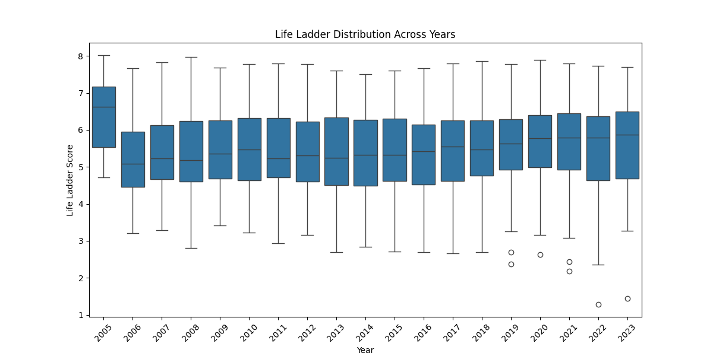
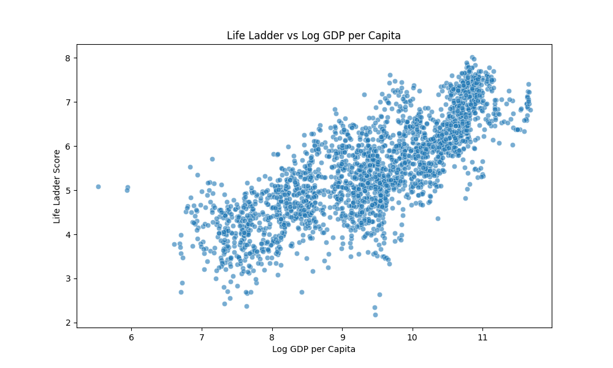
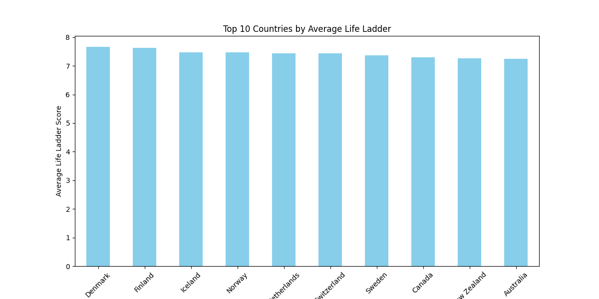

# HAPPINESS

## Overview
The HAPPINESS dataset provides insights into the well-being and quality of life across various countries and years. It captures important metrics related to life satisfaction, economic output, social support, health, freedom, and perceived corruption. Analyzing this dataset can help identify trends in happiness and explore how different factors correlate with life satisfaction.

## Column Details
The dataset contains the following columns:
- **Country name**: The unique name of the country.
- **year**: The year the data was collected, ranging from 2005 to 2023.
- **Life Ladder**: A measure representing life satisfaction, with higher values indicating greater satisfaction.
- **Log GDP per capita**: The natural log of GDP per capita, providing an economic context for the Life Ladder score.
- **Social support**: A metric indicating the perceived support from family, friends, and the community.
- **Healthy life expectancy at birth**: The average number of years that a newborn can expect to live in good health.
- **Freedom to make life choices**: A perception of freedom individuals feel they have to make choices concerning their lives.
- **Generosity**: A measure of the willingness to give to others.
- **Perceptions of corruption**: The level of corruption perceived in government and business.
- **Positive affect**: The frequency of positive emotions experienced by individuals.
- **Negative affect**: The frequency of negative emotions experienced by individuals.

## Numerical Details
The numerical columns in the dataset reveal important statistics:
- **Year**: Ranges from 2005 to 2023, with a mean of approximately 2015.
- **Life Ladder**: Mean score of 5.484, ranging from 1.281 (min) to 8.019 (max).
- **Log GDP per capita**: Averages around 9.400, indicating a positive economic context for well-being.
- **Social support**: High average value of 0.809 suggests a generally supportive environment across sampled countries.
- Other variables such as healthy life expectancy (mean: 63.402), freedom to make choices (mean: 0.750), and perceptions of corruption (mean: 0.744) further support the general well-being narrative.

## Categorical Details
- **Column 'Country name'**:
  - Unique value count: 165.
  - Most frequent value (mode): Lebanon (18 occurrences).
  - Missing values: 0 (0.00% of total).

## Visual Analysis

### Life Ladder Distribution Across Years

The image presents a box plot titled "Life Ladder Distribution Across Years." Here’s an analysis based on the visible elements:

#### Description of the Graph
- **Type of Graph**: Box Plot summarizing the distribution of Life Ladder scores across years from 2005 to 2023.

#### Key Observations
- The overall trend shows stability in median scores around 5.
- Increased variability in box plots and notable outliers in 2020 and 2023 indicate fluctuations in well-being.

#### Implications
- This consistency suggests a resilient societal framework but highlights the need for further investigation into outlier years' conditions.

### Relationship Between Life Ladder and Log GDP per Capita

This scatter plot illustrates the relationship between the Life Ladder score on the y-axis and Log GDP per Capita on the x-axis.

#### Description of the Graph
- **Key Features**: Shows positive correlation; as economic output increases, happiness scores tend to increase as well.

#### Key Observations
- Most points cluster in mid-range scores, emphasizing that while GDP influences happiness, many additional factors are at play.

#### Implications
- The correlation indicates economic robustness is crucial for quality of life, but it highlights the complexity of the factors affecting life satisfaction.

### Top 10 Countries by Average Life Ladder Score

The provided image is a bar graph titled "Top 10 Countries by Average Life Ladder Score." 

#### Description of the Graph
- **Type**: Bar graph comparing average Life Ladder scores across 10 leading countries.

#### Key Observations
- Scores for these countries are predominantly above 7, indicating high life satisfaction and consistency in well-being.

#### Implications
- Suggests effective policies and economic stability in these nations contribute significantly to high life satisfaction ratings.

## How the Analysis Was Carried Out
The analysis involved several steps:
1. Data Cleaning: Ensuring non-null values for significant numerical variables and examining categorical data.
2. Descriptive Statistics: Calculating mean, standard deviation, minimum, maximum, and quartiles for numerical analysis.
3. Visual Representation: Creating box plots, scatter plots, and bar graphs to visualize data trends, correlations, and distributions.
4. Insight Generation: Interpreting visual and statistical data to derive meaningful implications regarding happiness and life satisfaction across various contexts.

## Findings
The analysis highlighted several key discoveries:
- **Trends**: Life satisfaction scores appear generally stable, with variations suggesting periods of significant change.
- **Correlations**: A positive relationship between Log GDP per Capita and the Life Ladder score indicates economic factors significantly relate to happiness.
- **Outliers**: Certain years displayed drops in scores, which may require deeper examination to understand societal shifts.
- **Country Comparisons**: The top-performing countries demonstrate that effective governance and social support play critical roles in enhancing life satisfaction.

Overall, this dataset provides a comprehensive view into the factors affecting happiness and can guide policymakers and researchers in improving societal well-being.