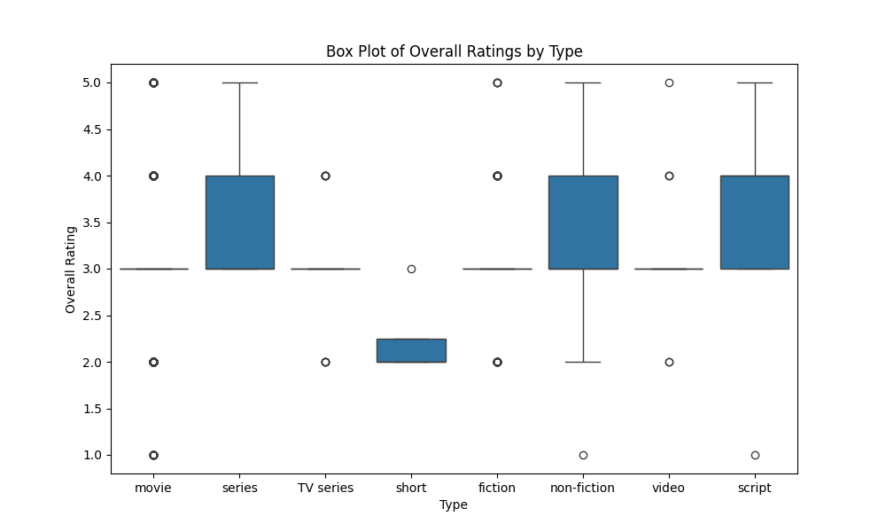
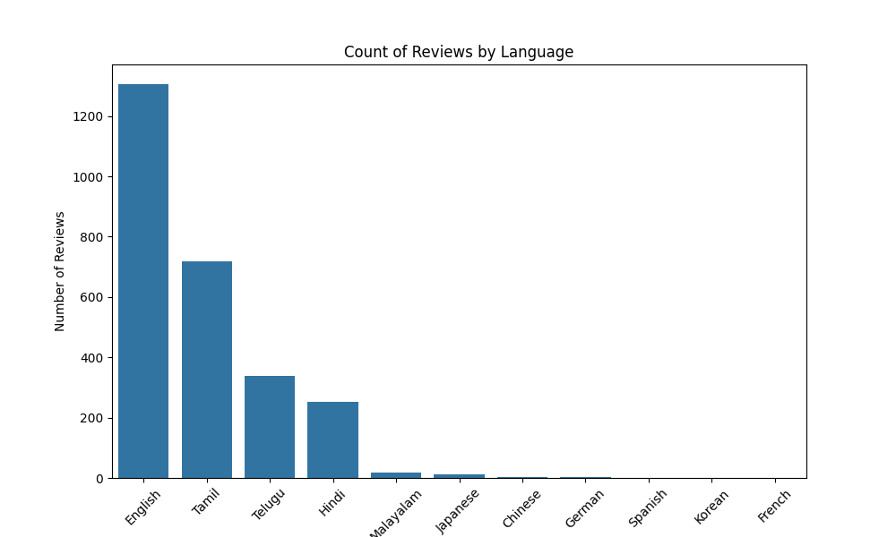
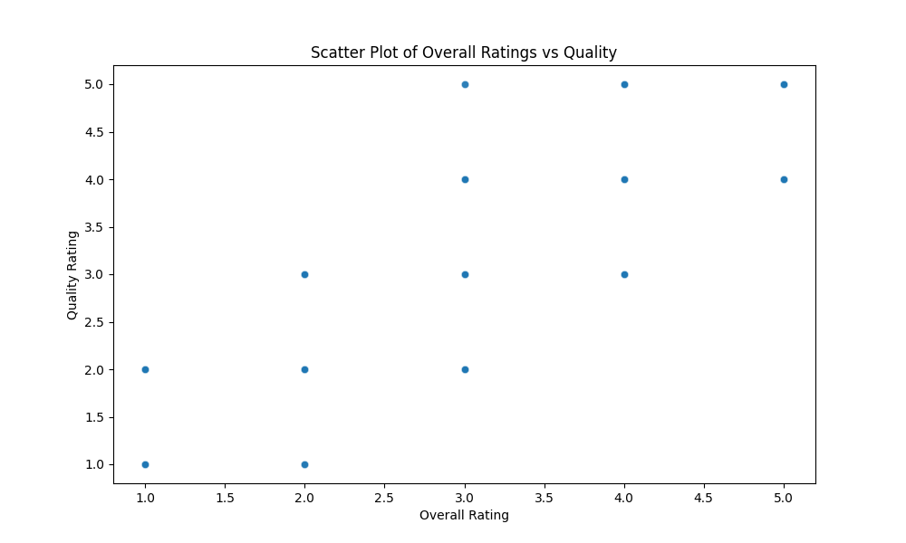

# MEDIA

## Overview
The 'MEDIA' dataset offers an extensive collection of media-related reviews, documenting various aspects such as the date of review, language, media type, title of the media, author of the review, and ratings concerning overall quality and repeatability. This dataset is pivotal for analyzing trends in media consumption and understanding user feedback across different languages and media types.

## Column Details
The dataset consists of the following columns:

| # | Column         | Non-Null Count | Dtype  |
|---|----------------|----------------|--------|
| 0 | date           | 2553 non-null  | object |
| 1 | language       | 2652 non-null  | object |
| 2 | type           | 2652 non-null  | object |
| 3 | title          | 2652 non-null  | object |
| 4 | by             | 2390 non-null  | object |
| 5 | overall        | 2652 non-null  | int64  |
| 6 | quality        | 2652 non-null  | int64  |
| 7 | repeatability  | 2652 non-null  | int64  |

- **date**: The date the review was created (object data type). However, there are 99 missing entries, indicating slight incompleteness in the timeline of reviews.
- **language**: The language in which the review was written, with no missing values, demonstrating varied linguistic representation.
- **type**: Refers to the media type (e.g., movie, series), also complete with no missing values.
- **title**: The name of the media item, featuring a total of 2312 unique titles, indicating a diverse media offering.
- **by**: Indicates the reviewer’s name, with 262 missing values, showing potential gaps in reviewer identification.
- **overall**: A rating of the media item (int64), with a complete dataset allowing for detailed numerical analysis.
- **quality**: A quality rating (int64) also rated on a complete scale.
- **repeatability**: Measures repeatability (int64), indicating how often content might be revisited.

## Numerical Details
The numerical columns in the dataset are analyzed as follows:

|         | overall   | quality  | repeatability |
|---------|-----------|----------|---------------|
| count   | 2652.000  | 2652.000 | 2652.000      |
| mean    | 3.048     | 3.209    | 1.495         |
| std     | 0.762     | 0.797    | 0.598         |
| min     | 1.000     | 1.000    | 1.000         |
| 25%     | 3.000     | 3.000    | 1.000         |
| 50%     | 3.000     | 3.000    | 1.000         |
| 75%     | 3.000     | 4.000    | 2.000         |
| max     | 5.000     | 5.000    | 3.000         |

### Insights:
- The overall ratings average around 3, indicating a moderately positive reception, while the quality ratings are also notable, indicating that quality may be perceived slightly higher.
- The repeatability score is low (close to 1), suggesting that most of the reviewed media are not frequently revisited.

## Categorical Details
Insights from categorical columns are as follows:

### Column 'date':
- Unique value count: 2055
- Most frequent value (mode): 21-May-06 (8 occurrences)
- Missing values: 99 (3.73% of total)

### Column 'language':
- Unique value count: 11
- Most frequent value (mode): English (1306 occurrences)
- Missing values: 0 (0.00% of total)

### Column 'type':
- Unique value count: 8
- Most frequent value (mode): movie (2211 occurrences)
- Missing values: 0 (0.00% of total)

### Column 'title':
- Unique value count: 2312
- Most frequent value (mode): Kanda Naal Mudhal (9 occurrences)
- Missing values: 0 (0.00% of total)

### Column 'by':
- Unique value count: 1528
- Most frequent value (mode): Kiefer Sutherland (48 occurrences)
- Missing values: 262 (9.88% of total)

## Visual Analysis

### Overall Ratings by Type

#### Description:
- **Axes:**
  - **X-axis:** Represents different types of media (movie, series, TV series, short, non-fiction, video, script).
  - **Y-axis:** Represents overall ratings, ranging roughly from 1 to 5.

#### Key Patterns and Insights:
- The box plot reveals that most types cluster between the 2.5-4.5 range with `short` having a notably lower median near 1.5.
- `Movie` and `TV series` types tend to receive higher ratings.

#### Implications:
The analysis reflects that media types like movies and TV series are generally favored over shorts, suggesting areas for content improvement and focus.

---

### Count of Reviews by Language

#### Type of Graph
- **Type**: Bar graph

#### Data Representation
- **X-Axis**: Languages
- **Y-Axis**: Number of Reviews 

#### Key Patterns and Insights:
- English dominates the reviews, transcending 1200 counts.
- Other languages like Tamil and Telugu follow, while the remaining languages display significantly lower counts.

#### Implications:
The dominance of English in reviews indicates its crucial role in media consumption patterns, highlighting a potential focus area for language accessibility.

---

### Overall Ratings vs Quality

#### Description of the Data
- **X-axis (Overall Rating)**: Ranges from 1 to 5.
- **Y-axis (Quality Rating)**: Ranges from 1 to 5.

#### Key Patterns and Insights:
- The scatter plot displays distributed ratings without linear correlation, suggesting a dichotomy in media reception.

#### Implications:
This trend indicates that media can fall into distinctly high or low-performing categories, impacting future media strategy.

## How the Analysis Was Carried Out
The analysis of the 'MEDIA' dataset involved the assessment of both numerical and categorical features. Statistical summaries provided insights into distribution trends, while visualizations facilitated an understanding of relationships between various attributes. Data cleaning addressed missing values and ensured clarity in interpreting results.

## Findings
Key discoveries from the analysis include:
- A predominance of English reviews and positive reception ratings, with notable variations in media types, suggesting strategies for targeted content development.
- Insights into language engagement can help attract larger audiences, while the low repeatability metric indicates a potential area for improvement in media retention strategies.